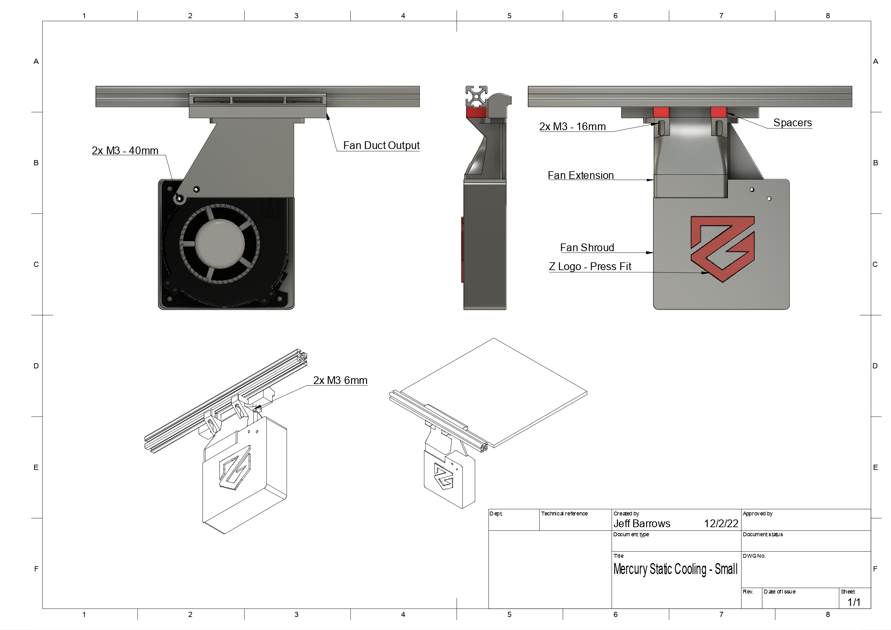

# Super Cooling System
This work is based on the [VzBoT RSCS system](https://grabcad.com/library/rscs-for-vzbot-1). Big thanks to the VzBoT crew for providing all of the CAD drawings and awesome videos for information, inspiration, and acceleration!



## What's SCS?
This is a system that's meant to cool top layer 3D printed extrusions quickly, helping you up the brrrr with better quality prints.

### What's the problem?
I found that as I tried to print at the higher end of my printers mechanical and extruder capabilities inevitably my print quality would suffer.  Especially challenging were overhangs, even 45 degree outer layers, and models with short layer print times (smaller single parts).

I moved to a dual 5015 cooling setup (EVA) for my part cooling which helped though at higher volumetric flows (~17mm3/sec), certain model features would become problematic (Benchy bow sag, ~45-50 degree overhangs in vase mode would deform at moderate speed, etc... ).

After watching and tuning for these scenarios it became clearer that cooling solutions that travel with the hot end have their limits. I think the main challenge is in that when printing at low layer times (<3sec), the fan ducts are generally not providing adequate cooling to the parts top layer surface because the hot end cooling fan is directly focused over the traveling nozzle.

More science necessary, though I believe cooling time could be calculated for a given material - helpful in determining quality print speed.

### Why try the SCS?
**First** I want to mention that the only reason I have this cooling problem is largely due to the [Zero-G Mercury project](https://github.com/ZeroGDesign/Mercury). By converting my heretofore fairly well tuned Ender 5 Pro printing at ~75mm/sec into something more 'moderately dangerous' - currently approaching 350mm/sec and 40mms3 volumetric flow.

After watching the [VzBoT video](https://youtu.be/65FVQ1jArME) on cooling solutions I was convinced to try this myself.

My hypothesis is that by adding additional top layer cooling, you'll be able to achieve higher speed/higher quality 3D prints.

If you're game, help me evaluate!

## SCS Parts, Printing, Installation
All printed files are found in the STL folder, CAD files *soon

You will neee M3 screws, 2 fans, and the ability to print 15mm overhans clearly - you can do it - or your money back!   

### Hardware
* 2x 120x35 centrifugal fans - make sure they match the voltage and pin  configuration your board can work with!
 * Ability to crimp, solder, or otherwise connect the fans to your 3D printer controller board
* Various M3 bolts/nuts:
 * 2x 40mm bolts to affix fan and shroud to mount
 * 2x 10mm M3 bolts to connect the fan mount and fan extension
 * 2x 6mm M3 bolts to connect the fan shroud to the fan extension
 * 2x 16mm M3 bolts to connect the entire system to the underisde of 2020 Aluminum extrusion
* Roll In Spring T-Nuts for mounting the blower to the top 2020 extrusions-  - something like [these](https://8020.net/fasteningmethods/hardware/tnuts/rollin/rollintnutwithballspring.html)

### Printed Parts
I recommend using the the following print settings:
* 3 Perimeters and 4 bottom/top solid layers
* 40% infill

All printed parts are included in the /STL folder - there are 5 parts:

* [Fan Duct Output - 175mm.stl](./stl/Bed%20Duct%20Output%20-%20175mm.stl)
* [Fan Extension.stl](./stl/Fan%20Extension.stl)
* [Fan Bracket.stl](./stl/Fan%20Bracket.stl)
* [Fan Shroud.stl](./stl/Fan%20Shroud.stl)
* 2x [Spacers.stl](./stl/Spacers.stl)


### Installation
1. Connect the Fan Bracket and Fan Extension together using the M3 10mm screws.
1. Thread the M3 6mm screws that will be used to attach the fan duct, let the screws protude slightly from the top so it's easier to mount the duct later. The screws will thread directly into the duct housing - no nuts necessary.
1. Insert the M3 16mm screws that will be used to mount the system to the underside of the 2020 extrusion, thread the t-nuts
1. Using roll-in t-nuts will allow you to tilt the duct and get them inserted under the 2020 extrusion
1. Center the duct so that it's in the middle of your print bed
1. Once the duct is hanging from the 2020 extrusions, insert the spacers between the the extrusion and the duct mount, and tighten the bolts
1. Mount the Fan Duct Ouput on top of the Fan Extension.
3. Mount the fan and the shroud

The base of Fan Duct Output should align with the base of your print bed - the idea is for the air to blow onto the top layer of your print, if it's too high above the bed, it won't be as effective.

You may need to adjust the height of the spacers to acheive optimal alignment for your printer.
[TODO] Add a few more spacer sizes to acommodate

### Klipper gcode macro example
Configure Klipper to control the fans and expose a Gcode macro so it can be controlled by your slicer.

#### Klipper Fan configuration
```
[output_pin Bed-Blower-R]
# BED BLOWER RIGHT
pin: PD12
pwm: true

[output_pin Bed-Blower-L]
# BED BLOWER LEFT
pin: PD13
pwm: true
```

#### Klipper GCode Macro
```
[gcode_macro BED_BLOWER]
gcode:
    # Use a default fan speed to off - expecting an INT as input
    
    
        
    
    SET_PIN PIN=Bed-Blower-R VALUE={S}
    SET_PIN PIN=Bed-Blower-L VALUE={S}
```

### SuperSlicer custom gcode integration
In order to automatically turn on the SCS fans at a specific layer height, you need to add some custom `Before Layer Change G-code` section under the 'Printer Settings' in SuperSlicer.

```
; Set SCS fans to 40% when you reach the 3rd layer
{if layer_num == 2} BED_BLOWER S=40{endif}
```

## Known Issues

### Fan Duct Outlet
* Lots of bridging in this print!!  I tried to keep the bridge distance low, around 15mm or so... It's a bummer, but hopefully it's doable.
* The current design doesn't provide as much bed coverage as I'd like - air flow is a bit more intense in the center than it is on the outer edges. More experimentation necessary

### Fan Bracket
* There are only 2 points to connect the fan to the bracket and it isn't as secure as I'd like. I'll probably look to add another mount point and potentially strengthen the hole on the point of the triangle...

## Experiments
Here are some pictures of benchys printed using the same g-code, but with  different cooling solutions.

Slicer configuration
2 Perimeters, 3 Top/Bottom solid
.2mm layer height
18% gyroid infill
Internal Perimeter Speed 250mm/s - External - 125mm/s
Max Volumetric Speed 43mm/s

1. Single 5015 Part cooling Fans at 100%
1. Dual 5015 Part cooling Fans at 100%
1. Dual 5015 Part cooling fans at 100% plus SCS fans at 100%

My interpretation of these results:
* Short layer times require increased cooling capacity
* Certain features (like overhangs) will degrade more than others when cooling isn't sufficient
* Layer times and cooling requirements are correlated - faster layer times will require more Cooling
* Prints that have more surface area may have a bit more time to cool before the next layer is applied, however, nozzle based cooling solutions will be less effective because they are only in a position to cool a section for a very short amount of time (as the filament is extruded from the nozzle)
* Smaller prints can benefit somewhat from increased nozzle based cooling systems because the ducts are likely to cover more surface area of the print for a more sustained period of time. Unfortunately smaller parts will likely have very short layer times and nozzle based cooling will probably not be sufficient   


